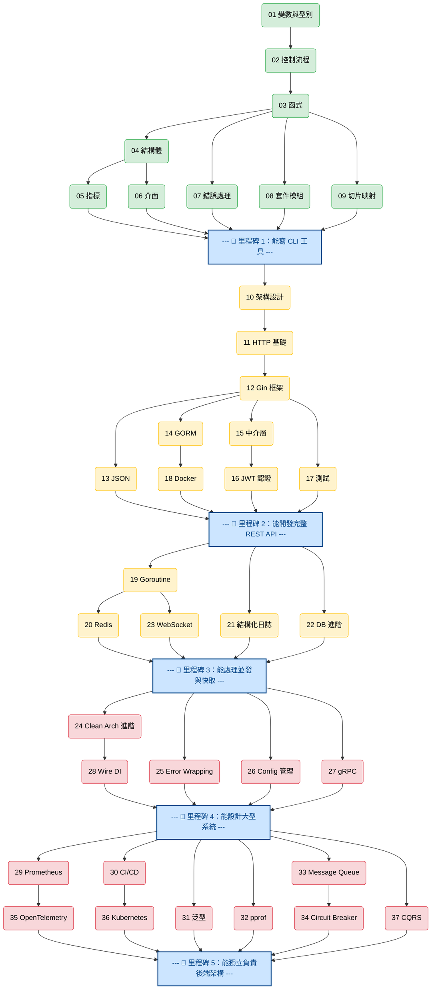
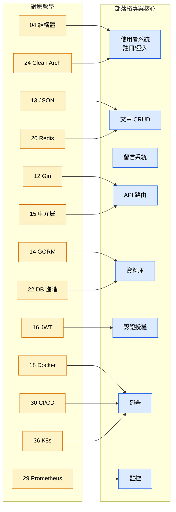

# Go 後端工程師學習路線圖 🗺️

> 37 堂課，從零到生產級 Go 後端工程師。
> 本路線圖幫助你找到最適合自己的學習路徑。

## 課程總覽

| # | 課程 | 主題 | 階段 |
|---|------|------|------|
| 01 | [變數與型別](tutorials/01-variables-types/) | `string` `int` `float64` `bool` `:=` | 🟢 初學者 |
| 02 | [控制流程](tutorials/02-control-flow/) | `if` `for` `switch` | 🟢 初學者 |
| 03 | [函式](tutorials/03-functions/) | 多回傳值、具名回傳、閉包 | 🟢 初學者 |
| 04 | [結構體與方法](tutorials/04-structs-methods/) | `struct` `method` 值接收器/指標接收器 | 🟢 初學者 |
| 05 | [指標](tutorials/05-pointers/) | `&` `*` 傳值/傳址 | 🟢 初學者 |
| 06 | [介面](tutorials/06-interfaces/) | `interface` 隱式實作、多型 | 🟢 初學者 |
| 07 | [錯誤處理](tutorials/07-error-handling/) | `error` `errors.New` 自訂錯誤 | 🟢 初學者 |
| 08 | [套件與模組](tutorials/08-packages-modules/) | `go mod` `import` 套件組織 | 🟢 初學者 |
| 09 | [切片與映射](tutorials/09-slices-maps/) | `slice` `map` `range` | 🟢 初學者 |
| 10 | [架構設計](tutorials/10-clean-architecture/) | Clean Architecture、分層架構 | 🟡 中級 |
| 11 | [HTTP 基礎](tutorials/11-http-basics/) | `net/http` Handler、路由 | 🟡 中級 |
| 12 | [Gin 框架](tutorials/12-gin-framework/) | Gin 路由、群組、參數綁定 | 🟡 中級 |
| 13 | [JSON 與 Struct Tags](tutorials/13-json-binding/) | `json:"tag"` `binding:"required"` | 🟡 中級 |
| 14 | [GORM 資料庫](tutorials/14-gorm-database/) | ORM、CRUD、Migration | 🟡 中級 |
| 15 | [中介層](tutorials/15-middleware/) | Logger、Auth、CORS、Recovery | 🟡 中級 |
| 16 | [JWT 認證](tutorials/16-jwt-auth/) | Token 簽發/驗證、受保護路由 | 🟡 中級 |
| 17 | [單元測試](tutorials/17-testing/) | `testing` `testify` 表格驅動測試 | 🟡 中級 |
| 18 | [Docker](tutorials/18-docker/) | Dockerfile、docker-compose | 🟡 中級 |
| 19 | [Goroutine](tutorials/19-goroutines/) | `go` `channel` `WaitGroup` `Mutex` | 🟡 中級 |
| 20 | [Redis 快取](tutorials/20-redis/) | 快取策略、Session、Rate Limiting | 🟡 中級 |
| 21 | [結構化日誌](tutorials/21-structured-logging/) | `slog` JSON 日誌、日誌等級 | 🟡 中級 |
| 22 | [資料庫進階](tutorials/22-database-advanced/) | 交易、索引、N+1、軟刪除 | 🟡 中級 |
| 23 | [WebSocket](tutorials/23-websocket/) | 即時通訊、聊天室 | 🟡 中級 |
| 24 | [Clean Arch 進階](tutorials/24-clean-arch-advanced/) | DI、Graceful Shutdown、Health Check | 🔴 資深 |
| 25 | [Error Wrapping](tutorials/25-error-wrapping/) | `fmt.Errorf %w` `errors.Is/As` | 🔴 資深 |
| 26 | [Config 管理](tutorials/26-config/) | Viper、環境變數、設定檔 | 🔴 資深 |
| 27 | [gRPC](tutorials/27-grpc/) | Protocol Buffers、RPC 呼叫 | 🔴 資深 |
| 28 | [Wire DI](tutorials/28-wire/) | 編譯期依賴注入 | 🔴 資深 |
| 29 | [Prometheus](tutorials/29-prometheus/) | 監控指標、PromQL、Golden Signals | 🔴 資深 |
| 30 | [CI/CD](tutorials/30-cicd/) | GitHub Actions、多階段建構 | 🔴 資深 |
| 31 | [泛型](tutorials/31-generics/) | 型別參數、約束、泛型資料結構 | 🔴 資深 |
| 32 | [pprof](tutorials/32-pprof/) | CPU/Memory Profiling、效能分析 | 🔴 資深 |
| 33 | [Message Queue](tutorials/33-message-queue/) | 訊息佇列、Fan-out、Dead Letter | 🔴 資深 |
| 34 | [Circuit Breaker](tutorials/34-circuit-breaker/) | 熔斷器、gobreaker、容錯 | 🔴 資深 |
| 35 | [OpenTelemetry](tutorials/35-opentelemetry/) | 分散式追蹤、Span、Trace | 🔴 資深 |
| 36 | [Kubernetes](tutorials/36-kubernetes/) | K8s 部署、HPA、Probe | 🔴 資深 |
| 37 | [CQRS](tutorials/37-cqrs/) | 讀寫分離、Event Sourcing | 🔴 資深 |

---

## 課程依賴關係圖

> 實線箭頭 = 建議的學習順序，虛線箭頭 = 跨階段的前置知識依賴。
> 同一欄內的課程可自由選擇順序。

---

## 三條推薦學習路線

### 路線 A：完全初學者（從零開始）

> 適合沒有 Go 經驗、或剛開始學程式設計的人。**預計 8-12 週。**

```mermaid
graph LR
    classDef active fill:#d4edda,stroke:#28a745,color:#000
    classDef next fill:#fff3cd,stroke:#ffc107,color:#000

    subgraph "第 1-3 週：語法基礎"
        A1["01 變數與型別"]:::active
        A2["02 控制流程"]:::active
        A3["03 函式"]:::active
        A4["09 切片與映射"]:::active
    end

    subgraph "第 4-5 週：物件導向"
        B1["04 結構體與方法"]:::active
        B2["05 指標"]:::active
        B3["06 介面"]:::active
        B4["07 錯誤處理"]:::active
        B5["08 套件與模組"]:::active
    end

    subgraph "第 6-8 週：Web 開發"
        C1["10 架構設計"]:::next
        C2["11 HTTP 基礎"]:::next
        C3["12 Gin 框架"]:::next
        C4["13 JSON"]:::next
        C5["14 GORM"]:::next
    end

    subgraph "第 9-10 週：功能完善"
        D1["15 中介層"]:::next
        D2["16 JWT 認證"]:::next
        D3["17 測試"]:::next
        D4["18 Docker"]:::next
    end

    subgraph "第 11-12 週：進階"
        E1["19 Goroutine"]:::next
        E2["20 Redis"]:::next
        E3["21 日誌"]:::next
    end

    A1 --> A2 --> A3 --> A4
    A4 --> B1 --> B2 --> B3 --> B4 --> B5
    B5 --> C1 --> C2 --> C3 --> C4 --> C5
    C5 --> D1 --> D2 --> D3 --> D4
    D4 --> E1 --> E2 --> E3
```

**學完後你能：**
- 用 Go 寫完整的 REST API
- 連接資料庫、處理認證
- 用 Docker 部署
- 理解並發基本概念

---

### 路線 B：有經驗的工程師（快速上手）

> 適合有其他語言經驗（Python / Java / JavaScript），想快速轉 Go 的人。**預計 4-6 週。**

```mermaid
graph LR
    classDef skim fill:#e2e3e5,stroke:#6c757d,color:#000
    classDef focus fill:#fff3cd,stroke:#ffc107,color:#000
    classDef deep fill:#f8d7da,stroke:#dc3545,color:#000

    subgraph "第 1 週：Go 特色（快速瀏覽）"
        A1["01-03 基礎語法"]:::skim
        A2["05 指標 ⭐"]:::focus
        A3["06 介面 ⭐"]:::focus
        A4["07 錯誤處理 ⭐"]:::focus
    end

    subgraph "第 2 週：Web 開發"
        B1["10 架構設計"]:::focus
        B2["12 Gin 框架"]:::focus
        B3["14 GORM"]:::focus
        B4["16 JWT"]:::focus
    end

    subgraph "第 3-4 週：Go 獨有"
        C1["19 Goroutine ⭐⭐"]:::deep
        C2["17 測試"]:::focus
        C3["25 Error Wrapping"]:::focus
        C4["31 泛型"]:::focus
    end

    subgraph "第 5-6 週：生產技能"
        D1["24 Clean Arch 進階"]:::deep
        D2["18 Docker + 30 CI/CD"]:::deep
        D3["29 Prometheus"]:::deep
        D4["36 Kubernetes"]:::deep
    end

    A1 --> A2 --> A3 --> A4
    A4 --> B1 --> B2 --> B3 --> B4
    B4 --> C1 --> C2 --> C3 --> C4
    C4 --> D1 --> D2 --> D3 --> D4
```

**⭐ = 跟其他語言差異最大，需要重點學習**

---

### 路線 C：主題式學習（按需選修）

> 適合已經有 Go 基礎，想針對特定主題深入的人。

```mermaid
graph TD
    classDef topic fill:#e8daef,stroke:#8e44ad,color:#000
    classDef course fill:#fdfefe,stroke:#5d6d7e,color:#000

    T1["🔧 Web API 開發"]:::topic
    T2["🗄️ 資料層"]:::topic
    T3["⚡ 並發與效能"]:::topic
    T4["🏗️ 架構設計"]:::topic
    T5["🚀 DevOps"]:::topic
    T6["📡 微服務"]:::topic

    T1 --- C11["11 HTTP"]:::course
    T1 --- C12["12 Gin"]:::course
    T1 --- C13["13 JSON"]:::course
    T1 --- C15["15 中介層"]:::course
    T1 --- C16["16 JWT"]:::course
    T1 --- C23["23 WebSocket"]:::course

    T2 --- C14["14 GORM"]:::course
    T2 --- C20["20 Redis"]:::course
    T2 --- C22["22 DB 進階"]:::course
    T2 --- C33["33 Message Queue"]:::course
    T2 --- C37["37 CQRS"]:::course

    T3 --- C19["19 Goroutine"]:::course
    T3 --- C31["31 泛型"]:::course
    T3 --- C32["32 pprof"]:::course

    T4 --- C10["10 Clean Arch"]:::course
    T4 --- C24["24 Clean Arch 進階"]:::course
    T4 --- C25["25 Error Wrapping"]:::course
    T4 --- C26["26 Config"]:::course
    T4 --- C28["28 Wire DI"]:::course

    T5 --- C17["17 測試"]:::course
    T5 --- C18["18 Docker"]:::course
    T5 --- C29["29 Prometheus"]:::course
    T5 --- C30["30 CI/CD"]:::course
    T5 --- C35["35 OpenTelemetry"]:::course
    T5 --- C36["36 Kubernetes"]:::course

    T6 --- C27["27 gRPC"]:::course
    T6 --- C34["34 Circuit Breaker"]:::course
    T6 --- C33b["33 Message Queue"]:::course
    T6 --- C35b["35 OpenTelemetry"]:::course
```

---

## 里程碑檢查點

每個階段結束後，用這些問題檢驗自己是否準備好進入下一階段。

### 🏁 里程碑 1：語法基礎（完成第 1-9 課後）

| ✅ 你應該能... | 對應課程 |
|---|---|
| 宣告變數、使用基本型別 | 01 |
| 寫 `if/for/switch` 控制流程 | 02 |
| 定義和呼叫函式，理解多回傳值 | 03 |
| 建立 struct 和 method | 04 |
| 解釋 `*` 和 `&` 的意義 | 05 |
| 定義 interface 並實作它 | 06 |
| 回傳和處理 `error` | 07 |
| 建立 Go module、匯入套件 | 08 |
| 使用 slice 和 map 操作資料 | 09 |

> **練習**：寫一個 CLI 待辦事項工具（Todo CLI），支援新增、列出、刪除、標記完成。

---

### 🏁 里程碑 2：Web 開發（完成第 10-18 課後）

| ✅ 你應該能... | 對應課程 |
|---|---|
| 說明 Clean Architecture 的分層 | 10 |
| 用 `net/http` 建立簡單伺服器 | 11 |
| 用 Gin 建立 RESTful API | 12 |
| 定義帶有 JSON tag 的 struct | 13 |
| 用 GORM 做 CRUD 和 Migration | 14 |
| 寫自訂 Middleware（Logger、Auth） | 15 |
| 實作 JWT 登入/註冊流程 | 16 |
| 寫表格驅動測試和 Mock | 17 |
| 寫 Dockerfile 並用 docker-compose 啟動 | 18 |

> **練習**：完成部落格 API 的核心功能——使用者註冊/登入、文章 CRUD、JWT 保護的路由，並用 Docker 跑起來。

---

### 🏁 里程碑 3：進階技能（完成第 19-23 課後）

| ✅ 你應該能... | 對應課程 |
|---|---|
| 用 goroutine + channel 寫並發程式 | 19 |
| 用 Redis 實作快取和 Rate Limiting | 20 |
| 用 `slog` 輸出結構化 JSON 日誌 | 21 |
| 寫資料庫交易，避免 N+1 問題 | 22 |
| 用 WebSocket 建立即時聊天 | 23 |

> **練習**：為部落格加上 Redis 快取（熱門文章）、結構化日誌、WebSocket 即時通知。

---

### 🏁 里程碑 4：架構品質（完成第 24-28 課後）

| ✅ 你應該能... | 對應課程 |
|---|---|
| 實作 Graceful Shutdown 和 Health Check | 24 |
| 用 `%w` 包裝錯誤並用 `errors.Is/As` 判斷 | 25 |
| 用 Viper 管理多環境設定 | 26 |
| 理解 gRPC 和 REST 的差異 | 27 |
| 理解依賴注入的原理 | 28 |

> **練習**：重構部落格專案——加入設定管理（dev/staging/prod）、完整的錯誤鏈、Graceful Shutdown。

---

### 🏁 里程碑 5：生產級（完成第 29-37 課後）

| ✅ 你應該能... | 對應課程 |
|---|---|
| 為服務加入 Prometheus 監控指標 | 29 |
| 設定 GitHub Actions CI/CD Pipeline | 30 |
| 用泛型寫可複用的工具函式 | 31 |
| 用 pprof 找到效能瓶頸 | 32 |
| 設計訊息佇列架構（解耦、削峰） | 33 |
| 用 Circuit Breaker 防止級聯失敗 | 34 |
| 用 OpenTelemetry 追蹤跨服務請求 | 35 |
| 寫 K8s Deployment + HPA | 36 |
| 理解 CQRS 和 Event Sourcing 的取捨 | 37 |

> **練習**：部署部落格到 Kubernetes，加上監控（Prometheus）、追蹤（OpenTelemetry）、CI/CD Pipeline。

---

## 與部落格專案的對應

教學不是獨立的——每課學到的技能都能用在部落格專案中。

| 部落格功能 | 用到的課程 | 學完就能做 |
|-----------|-----------|-----------|
| 使用者註冊/登入 | 04, 12, 14, 16 | 完整的認證系統 |
| 文章 CRUD | 12, 13, 14, 22 | RESTful 文章 API |
| 留言系統 | 12, 13, 14 | 巢狀留言功能 |
| 快取加速 | 20 | Redis 快取熱門文章 |
| 即時通知 | 19, 23 | WebSocket 新留言通知 |
| 結構化日誌 | 21 | JSON 格式的請求日誌 |
| 容器化部署 | 18, 30 | Docker + CI/CD |
| 生產監控 | 29, 35 | Prometheus + Tracing |
| K8s 部署 | 36 | 自動擴展、零停機更新 |

---

## 常見問題

### Q: 一定要按照順序學嗎？
第 1-9 課建議按順序（語法有前後依賴）。第 10 課以後可以根據需要跳著學，但請參考上面的依賴關係圖確認你有前置知識。

### Q: 每課大概要多久？
- 🟢 初學者課程：每課 1-2 小時
- 🟡 中級課程：每課 2-3 小時
- 🔴 資深課程：每課 3-4 小時（含實作練習）

### Q: 我只想學後端 API 開發，哪些課必修？
最精簡路線：01 → 02 → 03 → 04 → 06 → 07 → 09 → 12 → 13 → 14 → 16 → 17（12 堂課）

### Q: 哪些課需要外部服務（Docker、Redis 等）？
| 課程 | 需要的服務 | 如何啟動 |
|------|-----------|---------|
| 18 Docker | Docker Desktop | 需要安裝 |
| 20 Redis | Redis Server | `docker run -p 6379:6379 redis` |
| 其他所有課 | 無 | 直接 `go run` |
