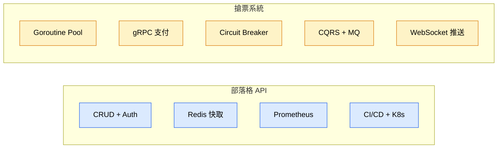

# Go 後端工程師學習路線圖

> 42 堂課，從零到 Staff/Principal 級 Go 後端工程師。
> 搭配兩個實戰專案：部落格 API + 搶票系統。

## 課程總覽

| # | 課程 | 主題 | 階段 |
|---|------|------|------|
| | **第一階段：Go 語法基礎** | | |
| 01 | [變數與型別](tutorials/01-variables-types/) | `string` `int` `float64` `bool` `:=` | 🟢 初學者 |
| 02 | [控制流程](tutorials/02-control-flow/) | `if` `for` `switch` | 🟢 初學者 |
| 03 | [函式](tutorials/03-functions/) | 多回傳值、具名回傳、閉包 | 🟢 初學者 |
| 04 | [結構體與方法](tutorials/04-structs-methods/) | `struct` `method` 值接收器/指標接收器 | 🟢 初學者 |
| 05 | [指標](tutorials/05-pointers/) | `&` `*` 傳值/傳址 | 🟢 初學者 |
| 06 | [介面](tutorials/06-interfaces/) | `interface` 隱式實作、多型 | 🟢 初學者 |
| 07 | [錯誤處理](tutorials/07-error-handling/) | `error` `errors.New` 自訂錯誤 | 🟢 初學者 |
| 08 | [套件與模組](tutorials/08-packages-modules/) | `go mod` `import` 套件組織 | 🟢 初學者 |
| 09 | [切片與映射](tutorials/09-slices-maps/) | `slice` `map` `range` | 🟢 初學者 |
| | **第二階段：Web 開發** | | |
| 10 | [架構設計](tutorials/10-clean-architecture/) | Clean Architecture、分層架構 | 🟡 中級 |
| 11 | [HTTP 基礎](tutorials/11-http-basics/) | `net/http` Handler、路由 | 🟡 中級 |
| 12 | [Gin 框架](tutorials/12-gin-framework/) | Gin 路由、群組、參數綁定 | 🟡 中級 |
| 13 | [JSON 與 Struct Tags](tutorials/13-json-binding/) | `json:"tag"` `binding:"required"` | 🟡 中級 |
| 14 | [GORM 資料庫](tutorials/14-gorm-database/) | ORM、CRUD、Migration | 🟡 中級 |
| 15 | [PostgreSQL + Schema + Index](tutorials/15-postgresql/) | 正規化、索引最佳化、EXPLAIN | 🟡 中級 |
| 16 | [Error Wrapping](tutorials/16-error-wrapping/) | `fmt.Errorf %w` `errors.Is/As` | 🟡 中級 |
| 17 | [中介層](tutorials/17-middleware/) | Logger、Auth、CORS、Recovery | 🟡 中級 |
| 18 | [JWT 認證](tutorials/18-jwt-auth/) | Token 簽發/驗證、受保護路由 | 🟡 中級 |
| | **第三階段：工程品質** | | |
| 19 | [單元測試](tutorials/19-testing/) | `testing` `testify` 表格驅動測試 | 🟡 中級 |
| 20 | [Config 管理](tutorials/20-config/) | Viper、環境變數、設定檔 | 🟡 中級 |
| 21 | [結構化日誌](tutorials/21-structured-logging/) | `slog` JSON 日誌、日誌等級 | 🟡 中級 |
| 22 | [Benchmark + Load Testing](tutorials/22-benchmark/) | `go test -bench`、效能比較、壓力測試 | 🟡 中級 |
| 23 | [Docker](tutorials/23-docker/) | Dockerfile、docker-compose | 🟡 中級 |
| 24 | [泛型](tutorials/24-generics/) | 型別參數、約束、泛型資料結構 | 🟡 中級 |
| | **第四階段：並發與即時** | | |
| 25 | [Goroutine 並發](tutorials/25-goroutines/) | `go` `channel` `WaitGroup` `Mutex` | 🟡 中級 |
| 26 | [Redis 快取](tutorials/26-redis/) | 快取策略、Session、Rate Limiting | 🟡 中級 |
| 27 | [WebSocket](tutorials/27-websocket/) | 即時通訊、聊天室 | 🟡 中級 |
| 28 | [資料庫進階](tutorials/28-database-advanced/) | 交易、軟刪除、N+1 問題 | 🟡 中級 |
| | **第五階段：進階架構** | | |
| 29 | [Clean Arch 進階](tutorials/29-clean-arch-advanced/) | Graceful Shutdown、Health Check、DI | 🔴 資深 |
| 30 | [gRPC](tutorials/30-grpc/) | Protocol Buffers、RPC 呼叫 | 🔴 資深 |
| 31 | [Wire DI](tutorials/31-wire/) | 編譯期依賴注入 | 🔴 資深 |
| 32 | [Message Queue](tutorials/32-message-queue/) | 訊息佇列、Fan-out、Dead Letter | 🔴 資深 |
| 33 | [CQRS](tutorials/33-cqrs/) | 讀寫分離、Event Sourcing | 🔴 資深 |
| | **第六階段：DevOps 與可觀測性** | | |
| 34 | [CI/CD](tutorials/34-cicd/) | GitHub Actions、多階段建構 | 🔴 資深 |
| 35 | [Prometheus](tutorials/35-prometheus/) | 監控指標、PromQL、Golden Signals | 🔴 資深 |
| 36 | [pprof](tutorials/36-pprof/) | CPU/Memory Profiling、效能分析 | 🔴 資深 |
| 37 | [OpenTelemetry](tutorials/37-opentelemetry/) | 分散式追蹤、Span、Trace | 🔴 資深 |
| 38 | [Kubernetes](tutorials/38-kubernetes/) | K8s 部署、HPA、Probe | 🔴 資深 |
| | **第七階段：韌性與容錯** | | |
| 39 | [Circuit Breaker](tutorials/39-circuit-breaker/) | 熔斷器、gobreaker、容錯 | 🔴 資深 |
| 40 | [分散式容錯](tutorials/40-failure-modeling/) | WAL、Saga、冪等性、Outbox | ⚫ Staff |
| 41 | [高可用架構](tutorials/41-high-availability/) | Sentinel、Failover、六層流量防線 | ⚫ Staff |
| 42 | [分散式一致性](tutorials/42-distributed-consistency/) | CAP、Inventory Token、分散式鎖 | ⚫ Staff |

---

## 課程依賴關係圖

```mermaid
graph TB
    classDef beginner fill:#d4edda,stroke:#28a745,color:#000
    classDef intermediate fill:#fff3cd,stroke:#ffc107,color:#000
    classDef advanced fill:#f8d7da,stroke:#dc3545,color:#000
    classDef staff fill:#e2e3e5,stroke:#383d41,color:#000
    classDef milestone fill:#cce5ff,stroke:#004085,color:#004085,stroke-width:2px

    L01("01 變數與型別"):::beginner
    L02("02 控制流程"):::beginner
    L03("03 函式"):::beginner
    L04("04 結構體"):::beginner
    L05("05 指標"):::beginner
    L06("06 介面"):::beginner
    L07("07 錯誤處理"):::beginner
    L08("08 套件模組"):::beginner
    L09("09 切片映射"):::beginner

    L01 --> L02 --> L03
    L03 --> L04
    L03 --> L07
    L03 --> L08
    L03 --> L09
    L04 --> L05
    L04 --> L06

    M1["🏁 里程碑 1：能寫 CLI 工具"]:::milestone
    L05 --> M1
    L06 --> M1
    L07 --> M1
    L08 --> M1
    L09 --> M1

    L10("10 架構設計"):::intermediate
    L11("11 HTTP 基礎"):::intermediate
    L12("12 Gin 框架"):::intermediate
    L13("13 JSON"):::intermediate
    L14("14 GORM"):::intermediate
    L15("15 PostgreSQL"):::intermediate
    L16("16 Error Wrapping"):::intermediate
    L17("17 中介層"):::intermediate
    L18("18 JWT 認證"):::intermediate

    M1 --> L10 --> L11 --> L12
    L12 --> L13
    L12 --> L14
    L14 --> L15
    L12 --> L16
    L16 --> L17
    L17 --> L18

    M2["🏁 里程碑 2：能開發完整 REST API"]:::milestone
    L13 --> M2
    L15 --> M2
    L18 --> M2

    L19("19 測試"):::intermediate
    L20("20 Config"):::intermediate
    L21("21 slog 日誌"):::intermediate
    L22("22 Benchmark"):::intermediate
    L23("23 Docker"):::intermediate
    L24("24 泛型"):::intermediate

    M2 --> L19
    M2 --> L20
    M2 --> L21
    L19 --> L22
    L20 --> L23
    M2 --> L24

    M3["🏁 里程碑 3：能交付生產品質的程式碼"]:::milestone
    L22 --> M3
    L23 --> M3
    L24 --> M3

    L25("25 Goroutine"):::intermediate
    L26("26 Redis"):::intermediate
    L27("27 WebSocket"):::intermediate
    L28("28 DB 進階"):::intermediate

    M3 --> L25
    L25 --> L26
    L25 --> L27
    M3 --> L28

    M4["🏁 里程碑 4：能處理並發與快取"]:::milestone
    L26 --> M4
    L27 --> M4
    L28 --> M4

    L29("29 Clean Arch 進階"):::advanced
    L30("30 gRPC"):::advanced
    L31("31 Wire DI"):::advanced
    L32("32 Message Queue"):::advanced
    L33("33 CQRS"):::advanced

    M4 --> L29
    M4 --> L30
    L29 --> L31
    M4 --> L32
    L32 --> L33

    M5["🏁 里程碑 5：能設計大型系統"]:::milestone
    L31 --> M5
    L33 --> M5

    L34("34 CI/CD"):::advanced
    L35("35 Prometheus"):::advanced
    L36("36 pprof"):::advanced
    L37("37 OpenTelemetry"):::advanced
    L38("38 Kubernetes"):::advanced

    M5 --> L34
    M5 --> L35
    M5 --> L36
    L35 --> L37
    L34 --> L38

    M6["🏁 里程碑 6：能部署和監控生產系統"]:::milestone
    L37 --> M6
    L38 --> M6

    L39("39 Circuit Breaker"):::staff
    L40("40 分散式容錯"):::staff
    L41("41 高可用架構"):::staff
    L42("42 分散式一致性"):::staff

    M6 --> L39
    L39 --> L40
    L40 --> L41
    L41 --> L42

    M7["🏁 里程碑 7：能獨立設計高可用分散式系統"]:::milestone
    L42 --> M7
```

---

## 實戰專案對應

| 專案 | 涵蓋課程 | 啟動方式 |
|------|---------|---------|
| **部落格 API** | 1-23, 26, 28-29, 34-36, 38 | `go run ./cmd/server/` |
| **搶票系統** | 25-27, 30-33, 37, 39-42 | `cd ticket-system && go run ./cmd/server/` |

> 💡 **第一次看專案程式碼？** 請先閱讀 [GUIDE-BLOG.md](GUIDE-BLOG.md)，裡面有完整的閱讀順序和從零建構步驟指南。

---

## 里程碑檢查點

### 🏁 里程碑 1：Go 語法基礎（第 1-9 課）

> **練習**：寫一個 CLI 待辦事項工具，支援新增、列出、刪除、標記完成。

### 🏁 里程碑 2：Web 開發（第 10-18 課）

> **練習**：完成部落格 API——使用者註冊/登入、文章 CRUD、JWT 保護路由、PostgreSQL Schema Design。

### 🏁 里程碑 3：工程品質（第 19-24 課）

> **練習**：為部落格加上 testify 測試、Viper 設定、slog 日誌、Benchmark，用 Docker 跑起來。

### 🏁 里程碑 4：並發與快取（第 25-28 課）

> **練習**：為部落格加上 Redis 快取、WebSocket 即時通知、資料庫交易和軟刪除。

### 🏁 里程碑 5：進階架構（第 29-33 課）

> **練習**：搶票系統核心——gRPC 支付服務、Wire DI、Message Queue、CQRS 讀寫分離。

### 🏁 里程碑 6：DevOps（第 34-38 課）

> **練習**：部署部落格到 Kubernetes，加上 CI/CD Pipeline、Prometheus 監控、OpenTelemetry 追蹤。

### 🏁 里程碑 7：韌性與容錯（第 39-42 課）

> **練習**：搶票系統加上 Circuit Breaker、WAL crash recovery、Saga 補償、六層流量防線。

---

## 常見問題

### Q: 一定要按照順序學嗎？
第 1-9 課建議按順序。第 10 課以後可以根據需要跳著學，但請參考依賴關係圖確認你有前置知識。

### Q: 每課大概要多久？
- 🟢 初學者課程：每課 1-2 小時
- 🟡 中級課程：每課 2-3 小時
- 🔴 資深課程：每課 3-4 小時
- ⚫ Staff 課程：每課 4-6 小時（含深入思考和實作）

### Q: 我只想學後端 API 開發，哪些課必修？
最精簡路線（12 堂課）：01 → 02 → 03 → 04 → 06 → 07 → 09 → 12 → 13 → 14 → 16 → 18

### Q: 哪些課需要外部服務？
| 課程 | 需要的服務 | 如何啟動 |
|------|-----------|---------|
| 23 Docker | Docker Desktop | 需要安裝 |
| 26 Redis | Redis Server | `docker run -p 6379:6379 redis`（搶票系統可選） |
| 其他所有課 | 無 | 直接 `go run` |
